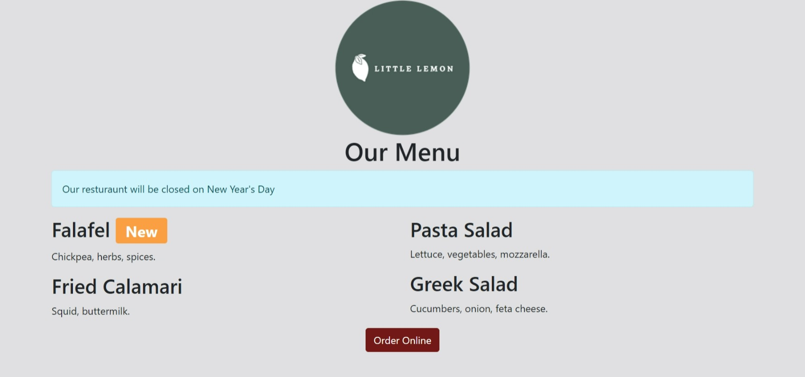
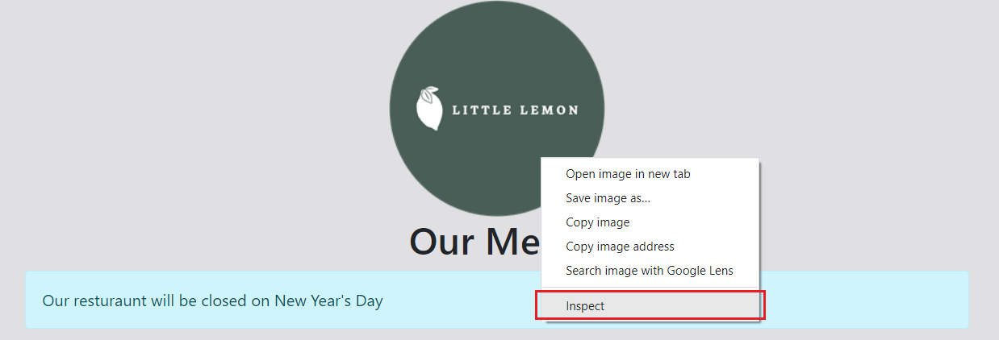
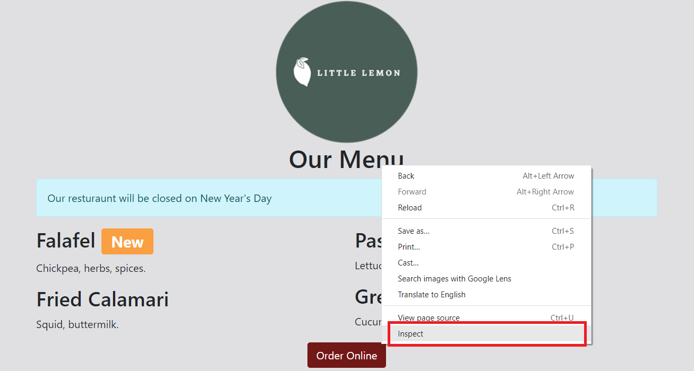

# Simple Web Page using HTML, CSS, and Bootstrap

Welcome to the repository for our simple web page project! This project demonstrates the creation of a basic web page using HTML, CSS, and the Bootstrap framework.

- [Visit this page](https://syedamir5560.github.io/simple-webpage-using-html-css-bootstrap/)

## Table of Contents

- [Description](#description)
- [Features](#features)
- [Usage](#usage)
- [Dependencies](#dependencies)
- [Contributions](#contributions)

## Description

This project showcases the development of a straightforward web page by combining the power of HTML, CSS, and Bootstrap. The web page includes various sections and components, highlighting the use of Bootstrap's responsive grid system and styling classes.

## Features

- **Responsive Design:** The web page layout adjusts seamlessly across different screen sizes, ensuring an optimal user experience on both desktop and mobile devices.
- **Bootstrap Integration:** We've utilized Bootstrap's CSS classes and components to style elements such as navigation bars, cards, buttons, and more.
- **Custom CSS:** In addition to Bootstrap, custom CSS styles have been applied to achieve a unique look for the web page.
- **Easy to Understand:** The codebase is well-structured and documented, making it suitable for developers of all skill levels to comprehend and modify.

## Usage

1. Clone this repository to your local machine using `git clone <repository_url>`.
2. Open the `index.html` file in your preferred web browser to view the web page.
3. Explore the project structure to understand how HTML, CSS, and Bootstrap components are used to build the page.
4. Experiment with making changes to the code to see how it affects the appearance and behavior of the web page.

## Dependencies

- [Bootstrap](https://getbootstrap.com/): The CSS framework responsible for styling the web page components.

## Contributions

Contributions are welcome! If you find any issues or would like to enhance the project, please fork this repository, make your changes, and submit a pull request. Your contributions will be greatly appreciated.
